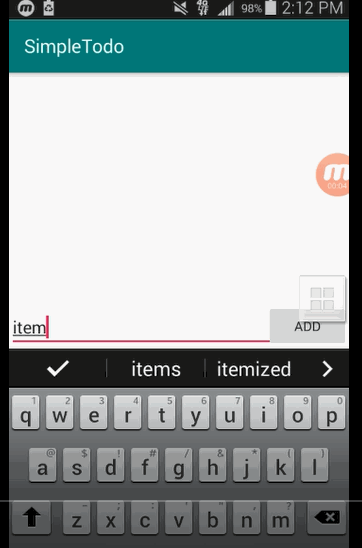

# Pre-work - *Simple Todo*

**Simple Todo** is an android app that allows building a todo list and basic todo items management functionality including adding new items, editing and deleting an existing item.

Submitted by: **Asim**

Time spent: **10** hours spent in total

## User Stories

The following **required** functionality is completed:

* [X] User can **successfully add and remove items** from the todo list
* [X] User can **tap a todo item in the list and bring up an edit screen for the todo item** and then have any changes to the text reflected in the todo list.
* [X] User can **persist todo items** and retrieve them properly on app restart

The following **optional** features are implemented:

* [ ] Persist the todo items [into SQLite](http://guides.codepath.com/android/Persisting-Data-to-the-Device#sqlite) instead of a text file
* [ ] Improve style of the todo items in the list [using a custom adapter](http://guides.codepath.com/android/Using-an-ArrayAdapter-with-ListView)
* [ ] Add support for completion due dates for todo items (and display within listview item)
* [ ] Use a [DialogFragment](http://guides.codepath.com/android/Using-DialogFragment) instead of new Activity for editing items
* [ ] Add support for selecting the priority of each todo item (and display in listview item)
* [ ] Tweak the style improving the UI / UX, play with colors, images or backgrounds

The following **additional** features are implemented:

* [ ] List anything else that you can get done to improve the app functionality!

## Video Walkthrough

Here's a walkthrough of implemented user stories:

GIF created with [LiceCap](http://www.cockos.com/licecap/).

## Project Analysis

As part of your pre-work submission, please reflect on the app and answer the following questions below:

**Question 1:** "What are your reactions to the Android app development platform so far? Compare and contrast Android's approach to layouts and user interfaces in past platforms you've used."

**Answer:** [Using the andriod studio program was complicated at first, but now I am getting more accustomed to it. Designing the app was not that hard, but some parts of the implementation was difficult. The only other platform I have used before was Eclipse for java. I think that Eclipse was more simpler to use then the andriod interface. Andriod Studio may have a more difficult way of implementaion compared to Eclipse, but designing apps on Andriod is simple.].

**Question 2:** "Take a moment to reflect on the `ArrayAdapter` used in your pre-work. How would you describe an adapter in this context and what is its function in Android? Why do you think the adapter is important? Explain the purpose of the `convertView` in the `getView` method of the `ArrayAdapter`."

**Answer:** [I would describe Array Adapter as a tool that connects the list of items to what you see on the app.I think that without this adapter, the interface that the user sees would not be updated. The purpose of the convertview in the getview method of the array adapter is to convert the layout of the app that we made into an interface that the user can see.].

## Notes

Describe any challenges encountered while building the app.
One challenge I encountered was that the videos is using an older version of Andriod studio, so some things didn't work correctly, for example when we were implementing persistance, we had to import the appache commons library and the video used an older version, so I had to search for the updated verison of implementing that library.

## License

    Copyright [yyyy] [name of copyright owner]

    Licensed under the Apache License, Version 2.0 (the "License");
    you may not use this file except in compliance with the License.
    You may obtain a copy of the License at

        http://www.apache.org/licenses/LICENSE-2.0

    Unless required by applicable law or agreed to in writing, software
    distributed under the License is distributed on an "AS IS" BASIS,
    WITHOUT WARRANTIES OR CONDITIONS OF ANY KIND, either express or implied.
    See the License for the specific language governing permissions and
    limitations under the License.
